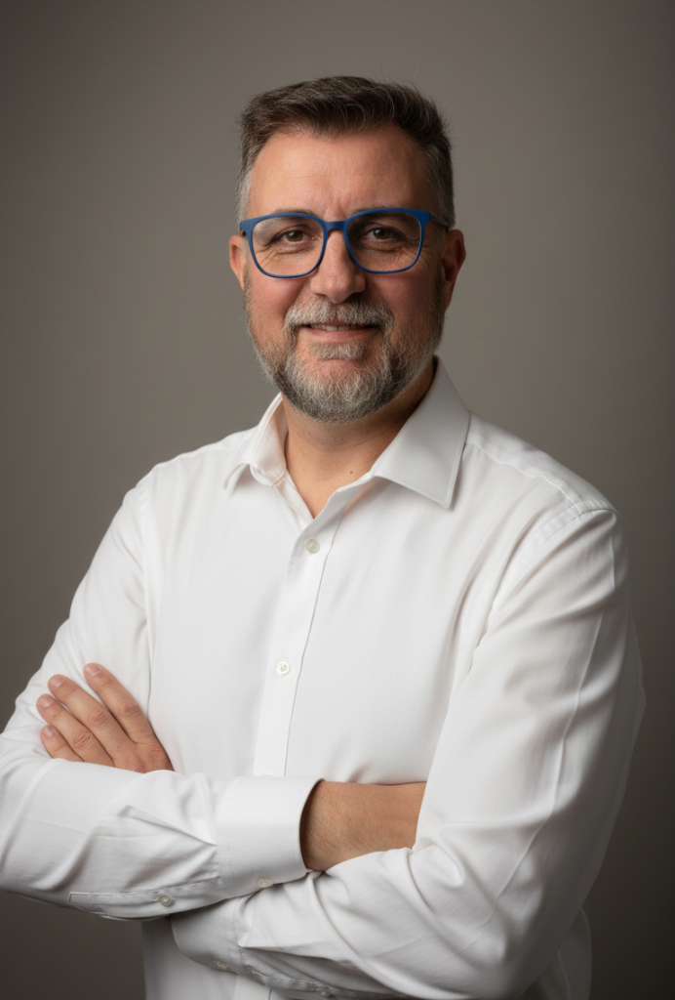

  

   
  
   

# Maximiliano R. Speranza

## Research-Oriented Technologist | Applied Physics • Advanced Materials • AI Systems

Ingeniero de perfil técnico–experimental con más de 20 años resolviendo problemas complejos en sistemas físicos y digitales. Trabajo en la intersección entre **materiales avanzados**, **modelado físico**, **arquitecturas computacionales no convencionales** y **IA aplicada**.

Mi foco actual está en **nuevos paradigmas de almacenamiento y computación**, con énfasis en:

- Materiales con comportamiento emergente  
- Dispositivos de memoria no volátil de ultra alta densidad  
- Modelos físicos verificables (no heurísticos)  
- Escalabilidad energética y térmica  

---

## Current Flagship Project — GENESIS

**GENESIS** es un marco teórico–experimental para un nuevo tipo de medio de almacenamiento físico:

- 🧠 Memoria sólida basada en materiales dopados con estados metaestables  
- ⚡ Escritura y lectura ultra-rápida  
- 🔥 Bajo consumo energético y mínima disipación térmica  
- 🕰️ Retención teórica del orden de miles de millones de años  
- 📐 Modelo validado bajo Landau–Ginzburg y análisis de barreras energéticas  

> Documentación con criterio *paper-grade* (IEEE / Nature level), priorizando reproducibilidad física y escalabilidad industrial.

---

## What I Bring to NVIDIA

No presento una idea: presento **un sistema físicamente consistente**.

- 🔬 Pensamiento físico primero  
- 🧩 Integración de materiales, hardware y software  
- 🧠 IA aplicada a sistemas reales (UTN, Cisco DevNet)  
- 🚀 Enfoque prototipo → validación → escalado  

Interés en colaboración con equipos de:

- NVIDIA Research  
- Advanced Hardware  
- Memory Systems  
- Compute-in-Memory  
- Arquitecturas post-SSD / post-DRAM  

---

## Technical Domains

- **Physics & Materials**: ferroelectric oxides, doped silicon, metastable lattices  
- **Modeling**: Landau–Ginzburg, barrier analysis, retention modeling  
- **AI / Software**: Python, applied ML, system automation  
- **Systems Thinking**: arquitectura completa, no componentes aislados  

---

> *“If it doesn’t survive physics, it doesn’t ship.”*

---

## Contact

    
    
     

GitHub Issues / Discussions  
Contacto directo bajo NDA, previa validación técnica.

---

**Nota**: Perfil deliberadamente orientado a interlocutores técnicos senior y equipos de I+D.  
No es un pitch comercial.
