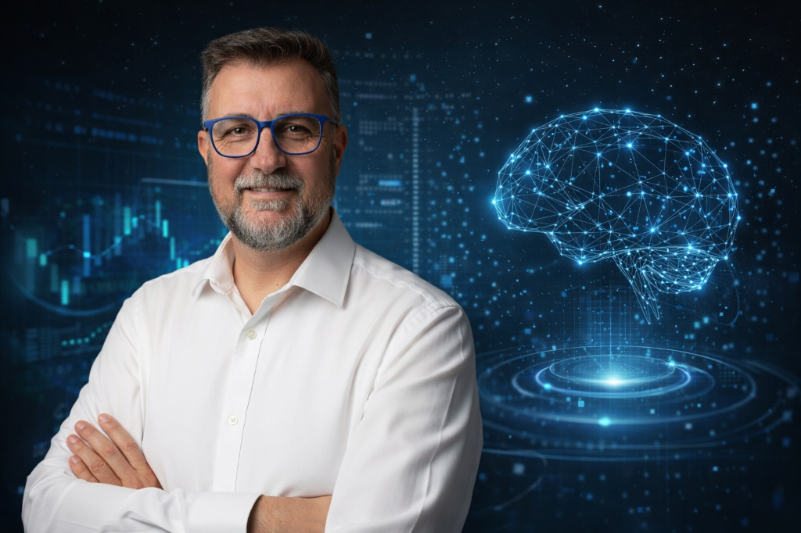

  

 

  <h1>Maximiliano R. Speranza</h1>
  <h3>IT • DevOps • DevNet • AI Engineer</h3>
  
<i>Integrando Infraestructura Crítica, Automatización de Redes e Inteligencia Artificial.</i>

   

  
  

 

## 🚀 Perfil Profesional

Ingeniero con una sólida trayectoria técnica de más de 20 años en **Operaciones de Sistemas e Infraestructura**. Mi carrera ha evolucionado desde la gestión de entornos físicos críticos hacia la **Ingeniería de Software y DevOps**, especializándome en la convergencia de **IT, OT (Operational Technology) e IA**.

Mi enfoque actual combina la robustez de la ingeniería de sistemas con la agilidad de las prácticas DevOps y la innovación de la Inteligencia Artificial aplicada.

---

## 🛠️ Stack Tecnológico

| Dominio | Tecnologías y Herramientas |
| :--- | :--- |
| **Artificial Intelligence** | `YOLO (v8/v11)` • `OpenCV` • `PyTorch` • `Computer Vision` • `Ultralytics` |
| **DevNet & Network** | `Cisco DevNet` • `Network Automation` • `IoT Protocols` • `Infrastructure as Code` |
| **DevOps & Cloud** | `Docker` • `CI/CD Pipelines` • `Git` • `Linux Administration` |
| **Backend & Logic** | `Python` • `FastAPI` • `SQLAlchemy` • `MySQL` |

---

## 🧠 Proyectos Destacados

### 🧬 GENESIS (Research & Development)
*Marco teórico-experimental para almacenamiento de datos de ultra-alta densidad.*
- **Foco:** Física aplicada, nuevos materiales y modelos de retención de datos a largo plazo.
- **Estado:** Validación teórica (v018) y búsqueda de escalabilidad industrial.
- **Tech:** Modelado físico avanzado, Análisis de datos.

### 👁️ PPE Detection System (Computer Vision)
*Sistema de seguridad industrial basado en IA para detección de Equipos de Protección Personal.*
- **Rendimiento:** 97.4% mAP en entornos reales.
- **Tech:** YOLOv11, Optimización para T4 GPU, Python.

### 🏷️ Auto-Label Engine
*Plataforma de automatización para curaduría de datasets.*
- **Función:** Generación masiva de etiquetas para entrenamiento de modelos de visión.
- **Tech:** FastAPI, YOLO-World, SQLAlchemy.

---

## 🎓 Formación y Certificaciones

- **Diplomatura en Inteligencia Artificial** | UTN.BA
- **DevNet Associate** | Cisco Networking Academy
- **Ingeniería en Sistemas de Información** | UBA (FIUBA)

---

  
<i>"Transforming complex physical challenges into efficient digital solutions."</i>

  

